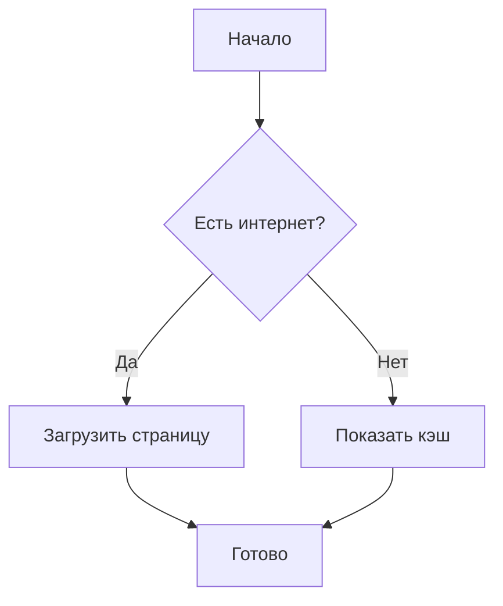
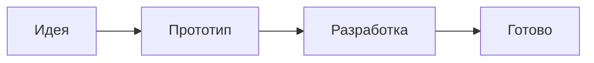
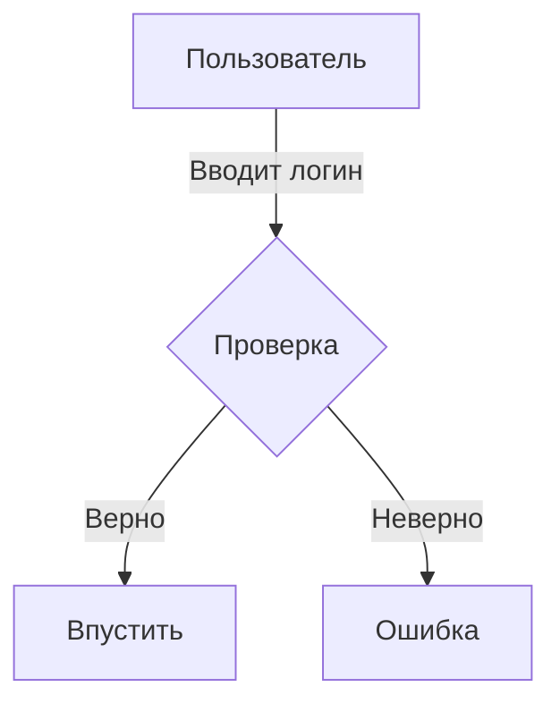
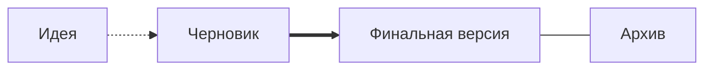

# MD Viewer

Добро пожаловать! Это **Markdown-редактор** с *живым превью*.

## Форматирование текста

- **Жирный** — две звёздочки вокруг текста: `**текст**`
- *Курсив* — одна звёздочка вокруг текста: `*текст*`
- `Код` — обратные кавычки вокруг текста: `` `код` ``
- ~~Зачёркнутый~~ — две тильды вокруг текста: `~~текст~~`

## Списки

**Маркированный** — минус и пробел перед строкой:

- Пункт первый
- Пункт второй

**Нумерованный** — цифра, точка и пробел перед строкой:

1. Первый пункт
2. Второй пункт

## Блок кода

Три обратные кавычки в начале и три в конце. Внутри — код:

```
def hello():
    print("Привет, мир!")
```

## Цитата

Символ `>` и пробел в начале строки:

> Это цитата.

## Таблица

Столбцы разделяются `|`, заголовок отделяется дефисами:

| Имя  | Возраст | Город     |
|------|---------|-----------|
| Анна | 25      | Москва    |

## Ссылки

В квадратных скобках — текст, на который нажимают (видимая часть ссылки).
В круглых — куда ведёт ссылка.

**В браузер** — `[текст](url)`:

[GitHub](https://github.com)

**В окно приложения** — `[текст](url+)` (плюс в конце):

[GitHub](https://github.com+)

## Изображения

В квадратных скобках — подпись (показывается, если картинка не загрузилась; можно оставить пустой).
В круглых — путь к файлу.

**Локальное** — ``:


**Из интернета** — ``:


---

## Схемы (Mermaid)

Блок ```mermaid — для рисования схем, графов, блок-схем.

### Как писать

Внутри блока ```mermaid каждая строка — это связь между элементами.

**Форма элемента задаётся скобками:**

| Скобки | Форма | Пример |
|--------|-------|-------|
| `[ ]` | прямоугольник | `A[Текст]` |
| `{ }` | ромб (условие) | `B{Вопрос?}` |
| `( )` | скруглённый | `C(Конец)` |
| `>]` | асимметричный | `D>Вывод]` |
| `[[ ]]` | подпрограмма | `E[[Расчёт]]` |

**Стрелки между ними:**

| Запись | Что значит |
|--------|-----------|
| `A --> B` | простая стрелка |
| `A -- Текст --> B` | стрелка с подписью |
| `A -.-> B` | пунктирная стрелка |
| `A ==> B` | толстая стрелка |
| `A --- B` | линия без стрелки |

**Направление схемы:**

| Команда | Направление |
|---------|------------|
| `graph TD` | сверху вниз |
| `graph LR` | слева направо |
| `graph BT` | снизу вверх |
| `graph RL` | справа налево |

### Простой пример



### Слева направо



### Сверху вниз с подписями



### Пунктирные и толстые стрелки



---

## Диаграммы (графики)

Блок ```chart — для построения графиков по таблице.

**Типы графиков:**
- `type: column` — столбчатая
- `type: line` — линейная
- `type: pie` — круговая
- `type: scatter` — точечная (3-й столбец — категория)
- `type: radar` — радарная

### Столбчатая диаграмма (Column)

```chart
type: column
title: Продажи по месяцам
xlabel: Месяц
ylabel: Тыс. руб.
| Месяц | Продажи |
|-------|---------|
| Янв   | 120     |
| Фев   | 200     |
| Мар   | 80      |
| Апр   | 150     |
| Май   | 300     |
| Июн   | 250     |
```

### Линейная диаграмма (Line)

```chart
type: line
title: Температура за неделю
xlabel: День недели
ylabel: Градусы
| День | C |
|------|---|
| Пн   | 18 |
| Вт   | 21 |
| Ср   | 20 |
| Чт   | 25 |
| Пт   | 22 |
| Сб   | 27 |
| Вс   | 30 |
```

### Круговая диаграмма (Pie)

```chart
type: pie
title: Бюджет проекта
| Статья       | Тыс.руб |
|--------------|---------|
| Разработка   | 500     |
| Дизайн       | 200     |
| Тестирование | 150     |
| Администрирование | 100 |
| Прочее       | 50      |
```

### Точечная диаграмма (Scatter)

```chart
type: scatter
title: Время загрузки vs Пользователи
xlabel: Пользователи (тыс.)
ylabel: Время (с)
| X     | Y    | Категория |
|-------|------|-----------|
| 1.5   | 0.8  | Гость     |
| 2.5   | 1.2  | Гость     |
| 2.8   | 0.9  | Гость     |
| 2.8   | 178  | Гость     |
| 2.9   | 72   | Гость     |
| 2.9   | 244  | Гость     |
| 2.9   | 113  | Гость     |
| 3.0   | 145  | Гость     |
| 3.0   | 85   | Гость     |
| 3.0   | 156  | Гость     |
| 3.0   | 162  | Гость     |
| 3.0   | 71   | Зарегистр.|
| 3.2   | 90   | Гость     |
| 3.2   | 204  | Гость     |
| 3.3   | 129  | Гость     |
| 3.3   | 95   | Гость     |
| 3.4   | 75   | Гость     |
| 3.4   | 114  | Гость     |
| 3.4   | 157  | Гость     |
| 3.5   | 79   | Зарегистр.|
| 3.6   | 180  | Гость     |
| 3.8   | 139  | Гость     |
| 3.8   | 139  | Гость     |
| 4.0   | 81   | Зарегистр.|
| 4.1   | 136  | Гость     |
| 4.9   | 124  | Гость     |
| 5.0   | 81   | Зарегистр.|
| 5.1   | 76   | Зарегистр.|
| 5.2   | 99   | Зарегистр.|
| 5.5   | 65   | Зарегистр.|
| 5.6   | 75   | Зарегистр.|
| 5.9   | 31   | Зарегистр.|
| 6.2   | 54   | Зарегистр.|
| 6.3   | 106  | Зарегистр.|
| 6.8   | 62   | Зарегистр.|
| 7.2   | 126  | Зарегистр.|
| 7.2   | 21   | Зарегистр.|
| 7.4   | 108  | Зарегистр.|
| 7.5   | 75   | Зарегистр.|
| 8.0   | 133  | Зарегистр.|
| 8.2   | 49   | Зарегистр.|
| 8.4   | 28   | Зарегистр.|
| 8.4   | 86   | Зарегистр.|
| 8.4   | 109  | Зарегистр.|
| 8.5   | 81   | Зарегистр.|
| 8.9   | 29   | Зарегистр.|
| 8.9   | 47   | Зарегистр.|
| 9.0   | 56   | Зарегистр.|
| 9.0   | 90   | Зарегистр.|
| 9.1   | 130  | Зарегистр.|
| 9.6   | 95   | Зарегистр.|
| 9.8   | 64   | Зарегистр.|
| 10.0  | 48   | Зарегистр.|
| 10.1  | 80   | Зарегистр.|
| 10.2  | 49   | Зарегистр.|
| 11.3  | 86   | Зарегистр.|
| 11.5  | 65   | Зарегистр.|
| 11.5  | 83   | Зарегистр.|
| 12.0  | 83   | Зарегистр.|
| 12.8  | 50   | Зарегистр.|
| 13.1  | 83   | Зарегистр.|
| 13.5  | 26   | Зарегистр.|
| 13.8  | 64   | Зарегистр.|
| 14.1  | 86   | Зарегистр.|
| 14.4  | 68   | Зарегистр.|
| 14.9  | 33   | Зарегистр.|
| 15.0  | 15   | Зарегистр.|
| 15.6  | 65   | Зарегистр.|
| 17.1  | 73   | Зарегистр.|
```

### Радарная диаграмма (Radar)

```chart
type: radar
title: Навыки
| Навык       | Оценка |
|-------------|--------|
| Python      | 9      |
| JavaScript  | 7      |
| SQL         | 8      |
| Git         | 6      |
| English     | 7      |
| Команда     | 9      |
```

> Приложение может работать без интернета.
